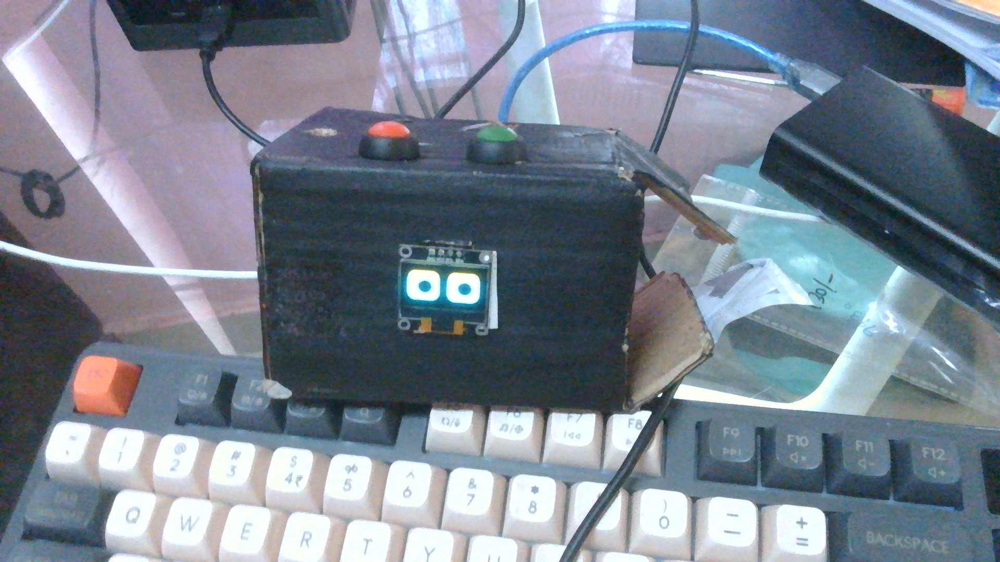
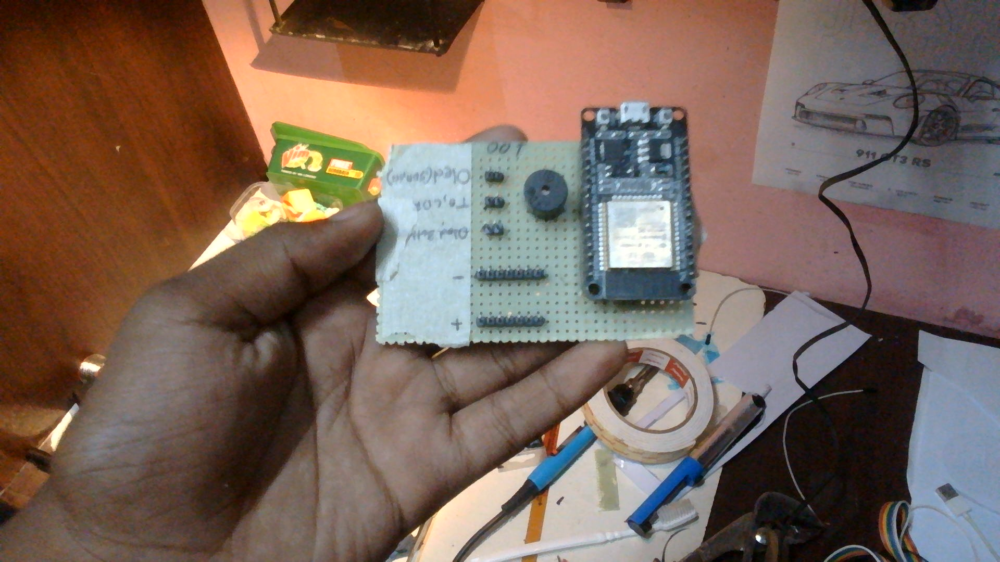

# Desk-Bud

  

Desk Bud Is a Cute Looking Robot(that doesnt move lol) that sits on your desk and reminds you of your tasks and set important times as alarm.

## Components

- ESP32 x1.
- LDR Module x1.
- OLED Module x1.
- Push Switces x2.
- lot of wires.
- Perfboard/breadboard.

  
 
## Languages And Libraries Used.

**Language Used :** Arduino C++.

**Libraries:**
- U8g2lib (Available in the Repo).
- Time (Built Into ESP32).
- Wire (Built Into ESP32).

## Purpose the Components Serve.

- **ESP32 :** Brain ( Controls the Entire Project).
- **LDR Module :** Checks If Room is Lit or Dark, Then Adjusts OLED Brightnes Accordingly.
- **OLED MODULE:** Shows eyes and alarm menu.
- **Push Switches :** Setting Time and Alarm.
- **Wires :** Connections.
- **Perfboard/BreadBoard :** Prototyping/ Below PCB Level Product.

## Purposes Of Libraries

- **U8g2lib :** Shows The faces ( those cute faces :]).
- **Time :** Keep Track Of time and Set Alarms.
- **Wire :** Communicate and Display Stuff on the OLED.
